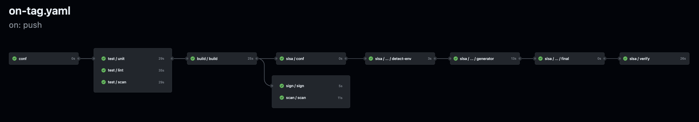
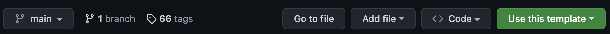
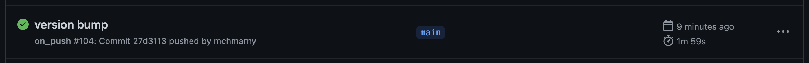
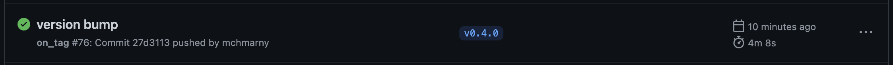

# s3cme

Sample Go app repo with test and release pipelines optimized for software supply chain security (S3C).



* [Repo Usage](#usage)
* [Provenance Verification](#provenance-verification)
  * [Manual](#manual)
  * [In Cluster](#in-cluster)

What's in the included workflow pipelines:

* `on-push` - PR qualification
  * Static code vulnerability scan using [trivy](https://github.com/aquasecurity/trivy)
  * Repo security alerts based on sarif reports CodeQL scans
* `on-tag` Release (container image build)
  * Image build/push using [ko](https://github.com/ko-build/ko) (includes SBOM generation)
  * Image vulnerability scan using [trivy](https://github.com/aquasecurity/trivy) with max severity checks parameter
  * Image signing and attestation using [cosign](https://github.com/sigstore/cosign)
  * SLSA provenance generation using [slsa-framework/slsa-github-generator](https://github.com/slsa-framework/slsa-github-generator)
  * SLSA provenance verification using both, [slsa-framework/slsa-verifier](https://github.com/slsa-framework/slsa-verifier), [CUE](https://cuelang.org/) policy using [cosign](https://github.com/sigstore/cosign)
* `on-schedule` - Repo hygiene
  * Semantic code analysis using CodeQL (every 4 hours)

## Repo Usage 

Use this template to create a new repo (click the green button and follow the wizard)



When done, clone your new repo locally, and navigate into it

```shell
git clone git@github.com:$GIT_HUB_USERNAME/$REPO_NAME.git
cd $REPO_NAME
```

Initialize your new repo. This will update all the references to your newly clone GitHub repository.

```shell
tools/init-repo
```

When completed, commit and push the updates to your repository: 

```shell
git add --all
git commit -m 'repo init'
git push --all
```

> The above push will trigger the `on-push` flow. You can navigate to the `/actions` in your repo to see the status of that pipeline. 



### Trigger release pipeline

The canonical version of the entire repo is stored in [.version](.version) file. Feel free to edit it (by default: `v0.0.1`). When done, trigger the release pipeline:

> If you did edit the version, make sure to commit and push that change to the repo first. You can also use `make tag` to automate the entire process.

```shell
export VERSION=$(cat .version)
git tag -s -m "initial release" $VERSION
git push origin $VERSION
```

### Monitor the pipeline 

Navigate to `/actions` in your repo to see the status of that release pipeline. Wait until all steps (aka jobs) have completed (green). 

> If any steps fail, click on them to see the cause. Fix it, commit/push changes to the repo, and tag a new release to re-trigger the pipeline again.



### Review produced image

When successfully completed, that pipeline will create an image. Navigate to the registry to confirm the image was created.

> This link will take you to the original template registry. Replace username and repo to navigate to yours.

https://github.com/mchmarny/s3cme/pkgs/container/s3cme


The image is the line item tagged with version (e.g. `latest`). The other three OCI artifacts named with the image digest in the registry are:

* `.sig` - cosign signature
* `.att` - SLSA attestations
* `.sbom` - SBOM (SPDX v2.3)

You can now take the image digest and query sigstore transparency service (Rekor). Easiest way to do that is to use the Chainguard's [rekor-search-ui](https://github.com/chainguard-dev/rekor-search-ui). Here is the entry for [s3cme v0.6.35](https://search.sigstore.dev/?hash=sha256:c85cdbb4cff81cd12f12af9cc7da4929f1b653a55896501e18755674739403fa).

## Provenance Verification  

Whenever you tag a release in the repo and an image is push to the registry, that image has an "attached" attestation in a form of [SLSA provenance (v0.2)](https://slsa.dev/provenance/v0.2). This allows you to trace that image all the way to its source in the repo (including the GitHub Actions that were used to generate it). That ability for verifiable traceability is called provenance. 

### Manual 

To verify the SLSA build provenance of an image that was generated by the `on-tag` pipeline manually cosign:

```shell
cosign verify-attestation \
   --type slsaprovenance \
   --certificate-identity-regexp "^https://github.com/slsa-framework/slsa-github-generator/.github/workflows/generator_container_slsa3.yml@refs/tags/v[0-9]+.[0-9]+.[0-9]+$" \
   --certificate-oidc-issuer https://token.actions.githubusercontent.com \
   --policy policy/provenance.cue \
   $digest
```

The terminal output will include the checks that were executed as part of the validation, as well as information about the subject (URI of the tag ref that triggered that workflow), with its SHA, name, and Ref.

```shell
The following checks were performed on each of these signatures:
  - The cosign claims were validated
  - Existence of the claims in the transparency log was verified offline
  - The code-signing certificate was verified using trusted certificate authority certificates
Certificate subject: https://github.com/slsa-framework/slsa-github-generator/.github/workflows/generator_container_slsa3.yml@refs/tags/v1.5.0
Certificate issuer URL: https://token.actions.githubusercontent.com
GitHub Workflow Trigger: push
GitHub Workflow SHA: 5ed1e3b75214316fd5cd09e77b88f41c01ea85ec
GitHub Workflow Name: on_tag
GitHub Workflow Repository: mchmarny/s3cme
GitHub Workflow Ref: refs/tags/v0.6.35
```

The output will also include JSON, which looks something like this (`payload` abbreviated): 

```json
{
   "payloadType": "application/vnd.in-toto+json",
   "payload": "eyJfdHl...V19fQ==",
   "signatures": [
      {
         "sig": "MEUCIQCl+9dSv9f9wqHTF9D6L1bizNJbrZwYz0oDtjQ1wiqmLwIgE1T1LpwVd5+lOnalkYzNftTup//6H9i6wKDoCNNhpeo="
      }
   ]
}
```

The `payload` field (abbreviated) is the base64 encoded [in-toto statement](https://in-toto.io/) containing the predicate containing the GitHub Actions provenance:

```shell
... | jq -r .payload | base64 -d | jq -r .
```

Returns:

```json
{
    "_type": "https://in-toto.io/Statement/v0.1",
    "predicateType": "https://slsa.dev/provenance/v0.2",
    "subject": [
        {
            "name": "ghcr.io/mchmarny/s3cme",
            "digest": {
                "sha256": "c85cdbb4cff81cd12f12af9cc7da4929f1b653a55896501e18755674739403fa"
            }
        }
    ],
    "predicate": {...}
}
```

### In Cluster

You can also verify the provenance of an image in your Kubernetes cluster.

> This assumes you already configured the sigstore admission controller in your Kubernetes cluster. If not, you can use the provided [tools/gke-cluster](tools/gke-cluster) script to create a cluster and configure sigstore policy-controller.

First, review the [policy/cluster.yaml](policy/cluster.yaml) file, and make sure the glob pattern matches your Artifact Registry (`**` will match any character). You can make this as specific as you want (e.g. any image in the project in specific region)

```yaml
images:
- glob: ghcr.io/mchmarny/**
```

Next, check the subject portion of the issuer identity (in this case, the SLSA generator workflow for containers, with the repo tag)

```yaml
identities:
- issuer: https://token.actions.githubusercontent.com
  subjectRegExp: "^https://github.com/slsa-framework/slsa-github-generator/.github/workflows/generator_container_slsa3.yml@refs/tags/v[0-9]+.[0-9]+.[0-9]+$"
```

Finally, the policy data that checks for `predicateType` on the image should include the content of the same policy ([policy/provenance.cue](policy/provenance.cue)) we've used during the SLSA verification using image release and in the above manual verification process. 

```yaml
policy:
   type: cue
   data: |
     predicateType: "https://slsa.dev/provenance/v0.2"
     ...
```

> Make sure the content is indented correctly

When finished, apply the policy into the cluster:

```shell
kubectl apply -f policy/slsa.yaml
```

To verify SLSA provenance on any namespace in your cluster, add a sigstore inclusion label to that namespace (e.g. `demo`):

```shell
kubectl label ns demo policy.sigstore.dev/include=true
```

Now, you should see an error when deploying images that don't have SLSA attestation created by your release pipeline:

```shell
kubectl run test --image=nginxdemos/hello -n demo
```

Will result in:

```shell
admission webhook "policy.sigstore.dev" denied the request: validation failed: no matching policies: spec.containers[0].image
index.docker.io/nginxdemos/hello@sha256:46bd594006f4bacc8a6c1cc2941ef842caf2358bc258619f7bea1558bc461b38
```

That policy failed because the image URI doesn't match the images glob we've specified (`glob: ghcr.io/mchmarny/**`). How about if we try to deploy image that does, but does not have SLSA attestation:

```shell
kubectl run test -n demo --image ghcr.io/mchmarny/s3cme-no-slsa@sha256:0d8b8a9e3635545476b880612d5a058616d7ac378b79b67ad412e9a9c11e7e45
```

Now the failure is on the SLSA policy due to lack of verifiable attestations:

```shell
admission webhook "policy.sigstore.dev" denied the request: validation failed: failed policy: slsa-attestation-image-policy: spec.containers[0].image
ghcr.io/mchmarny/s3cme@sha256:c85cdbb4cff81cd12f12af9cc7da4929f1b653a55896501e18755674739403fa attestation keyless validation failed for authority authority-0 for ghcr.io/mchmarny/s3cme@sha256:0d8b8a9e3635545476b880612d5a058616d7ac378b79b67ad412e9a9c11e7e45: no matching attestations:
```

Finally deploy image form the trusted registry and with SLSA attestation: 

```shell
kubectl run test -n demo --image ghcr.io/mchmarny/s3cme@sha256:c85cdbb4cff81cd12f12af9cc7da4929f1b653a55896501e18755674739403fa
```

Now, the response is simple: 

```shell
pod/test created
```

This demonstrates how the policy-controller admission controller enforces [SLSA provenance](https://slsa.dev/provenance/v0.2) policy in your cluster based on verifiable supply-chain metadata from [cosign](https://github.com/sigstore/cosign).

## Disclaimer

This is my personal project and it does not represent my employer. While I do my best to ensure that everything works, I take no responsibility for issues caused by this code.
