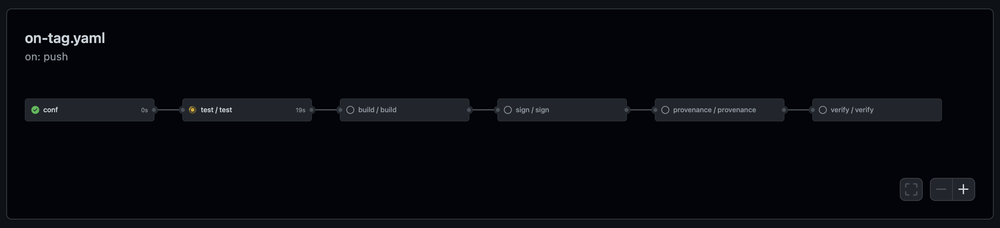

# s3cme

Sample Go app repo with test (on push) and release (on tag) pipelines optimized for software supply chain security (S3C). Includes Terraform setup for [OpenID Connect](https://openid.net/connect/) (IODC) in GCP with Artifact Registry, and KMS service configuration.



What's included in the PR qualification (on push), and release (on tag) pipelines:

* On push:
  * Semantic code analysis using CodeQL
  * Source vulnerability scan using Trivy
  * Sarif-formatted report for repo alerts
* On tag:
  * Same test as on push
  * Image build and registry push using ko with with SBOM generation 
  * Image vulnerability scan using Trivy with max severity checks
  * Image signing using KMS key and attestation using cosign
  * SLSA provenance generation for GitHub workflow
  * SLSA provenance verification using cosign and CUE policy

## Usage 

1. Use this template to create a new repo (green button)
1. Clone the new repo locally and navigate into it
1. Run Terraform init
```shell
terraform -chdir=./setup init
```
1. Apply the Terraform configuration
```shell
terraform -chdir=./setup apply
```
1. When promoted, provide:
   * `project_id` - GCP project ID
   * `location` - GCP region
   * `git_repo` - Your qualified name of your repo (e.g. `username/repo`)
   * `name` - your application name (e.g. the repo portion from `git_repo`)
1. Update following in `conf` job in `.github/workflows/on-tag.yaml` file to the values output by Terraform
   * `IMG_NAME`
   * `KMS_KEY`
   * `PROVIDER_ID`
   * `REG_URI`
   * `SA_EMAIL`
1. Update Go and CUE policy file references to your own repo:
   * `./go.mod:module`
   * `./cmd/server/main.go`
   * `./policy/provenance.cue`
1. Write some code, PR and tag as needed ;) 

## Validation 

Whenever you create a tag, and the resulting image is push to the registry with an SBOM, that image also has an attestation with the [SLSA provenance (v0.2)](https://slsa.dev/provenance/v0.2), which allows you to trace that image to its source in the repo (including the GitHub Actions that were used to generate it). To validate image provenance: 

```shell
COSIGN_EXPERIMENTAL=1 cosign verify-attestation \
   --type slsaprovenance \
   --policy policy/provenance.cue \
   $IMAGE_DIGEST
```

> The `COSIGN_EXPERIMENTAL` variable is necessary to verify the image with the transparency log

The terminal output of the above command will be lengthy, but here are the important bits: 

```shell
will be validating against CUE policies: [policy/provenance.cue]
The following checks were performed on each of these signatures:
  - The cosign claims were validated
  - Existence of the claims in the transparency log was verified offline
  - Any certificates were verified against the Fulcio roots.
Certificate subject: 
   https://github.com/mchmarny/s3cme/.github/workflows/provenance.yaml@refs/tags/v0.3.11
Certificate issuer URL:  https://token.actions.githubusercontent.com
GitHub Workflow Trigger: push
GitHub Workflow SHA: 2c74ceec0440aa41d28469f1de5b7df57eedc875
GitHub Workflow Name: on_tag
GitHub Workflow Trigger mchmarny/s3cme
GitHub Workflow Ref: refs/tags/v0.3.11
```

There also JSON returned, which looks something like this (`payload` abbreviated): 

```json
{
   "payloadType": "application/vnd.in-toto+json",
   "payload": "eyJfdHl...V19fQ==",
   "signatures": [
      {
         "keyid": "",
         "sig": "MEUCIQCl+9dSv9f9wqHTF9D6L1bizNJbrZwYz0oDtjQ1wiqmLwIgE1T1LpwVd5+lOnalkYzNftTup//6H9i6wKDoCNNhpeo="
      }
   ]
}
```

The `payload` field (abbreviated) is the base64 encoded in-toto statment containing the predicate the GitHub Actions provenance job create for this image:

```json
{
    "_type": "https://in-toto.io/Statement/v0.1",
    "predicateType": "https://slsa.dev/provenance/v0.2",
    "subject": [
        {
            "name": "us-west1-docker.pkg.dev/cloudy-s3c/s3cme/s3cme",
            "digest": {
                "sha256": "22080f8082e60e7f3ab745818e59c6f513464de23b53bbd28dc83c4936c27cbc"
            }
        }
    ],
    "predicate": {...}
}
```

## Cluster Image Policy

Assuming you already configured sigstore admission controller in your Kubernetes cluster, you can now install [ClusterImagePolicy](policy/cluster.yaml) which will ensure that all images deployed into a namespace that has policy-controller admission controller enabled adheres to the [same policy](policy/provenance.cue) that we used to validate the iamge using release. 

> See [tools/cluster](tools/cluster) for example how you can quickly create cluster and configure sigstore admission controller.

To configure your namespace:

```shell
kubectl label namespace demo policy.sigstore.dev/include=true
```

Then, review the [policy/cluster.yaml](policy/cluster.yaml) file and update with your repo/workflow information (e.g. registry URI: `glob`, GitHub repo info: `subjectRegExp`, and attestation rule: `data`)

> For data, you can just paste the rule from [policy/provenance.cue](policy/provenance.cue)

When done, apply the policy to the configured namespace (e.g. `demo`)

```shell
kubectl apply -n demo -f policy/cluster.yaml
```

Now, you should see errors when deploying images that don't have SLSA attestation created by your release pipeline:

```shell
kubectl run test --image=nginxdemos/hello --port=8080
Error from server (BadRequest): admission webhook "policy.sigstore.dev" denied the request: validation failed: no matching policies: spec.containers[0].image
index.docker.io/nginxdemos/hello@sha256:409564c3a1d194fcfd85cad7a231b61670ab6c40d04d80e86649d1fe7740436e
```

## Disclaimer

This is my personal project and it does not represent my employer. While I do my best to ensure that everything works, I take no responsibility for issues caused by this code.
